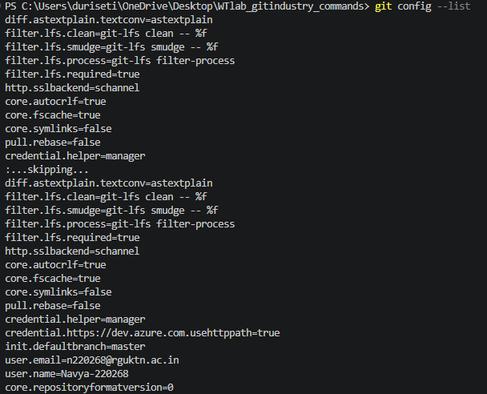
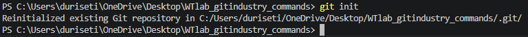
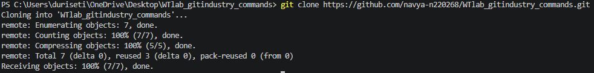

# Git Industry Level Commands Documentation

## 1. Git Configuration Commands

### git config --global user.name

**Syntax:**
git config --global user.name "Your Name"

**Purpose:**
Sets the global username that will appear in your Git commits.

**Example:**
git config --global user.name "Mohitha-220321"

**Output Screenshot:**

### git config --global user.email

**Syntax:**
git config --global user.email

**Purpose:**
Sets the global email address that will appear in your Git commits.

**Example:**
git config --global user.email 

**Output Screenshot:**

### git config --list

**Purpose:**
Displays all the Git configuration settings currently applied.

**Output Screenshot:**

## Repository set up commands

### git init

**Purpose:**
Creates a new Git repository in the current folder.

**Output Screenshot:**

### git clone

**Purpose:**
Copies an existing remote repository to your local system.

**Output Screenshot:**

### git clone --branch

**Purpose:**
Clones a specific branch from a remote repository.

**Output Screenshot:**

### git clone --depth

**Purpose:**
Clones a repository with limited commit history (shallow clone).

**Output Screenshot:**

## Repository Status & Inspection

### git status

**Purpose:**
Shows the current state of files (modified, staged, and untracked).

**Output Screenshot:**

### git log

**Purpose:**
Displays the complete commit history of the repository.

**Output Screenshot:**

### git log --oneline

**Purpose:**
Shows commit history in a short one-line format.

**Output Screenshot:**

### git log --graph

**Purpose:**
Displays commit history in a visual branch graph format.

**Output Screenshot:**

### git show

**Purpose:**
Shows detailed information about a specific commit.

**Output Screenshot:**

### git diff

**Purpose:**
Shows changes made in files that are not yet staged.

**Output Screenshot:**

### git diff --staged

**Purpose:**
Shows changes that are staged but not yet committed.

**Output Screenshot:**

### git blame

**Purpose:**
Shows who last modified each line of a file.

**Output Screenshot:**

### git reflog

**Purpose:**
Displays the history of all HEAD movements and actions.

**Output Screenshot:**

### git shortlog

**Purpose:**
Summarizes commit history grouped by author.

**Output Screenshot:**

This is testing git diff
test git diff
