# Git Industry Level Commands Documentation

## 1. Git Configuration Commands

### git config --global user.name

**Syntax:**
git config --global user.name "Your Name"

**Purpose:**
Sets the global username that will appear in your Git commits.

**Example:**
git config --global user.name "Navya-220268"

**Output Screenshot:**
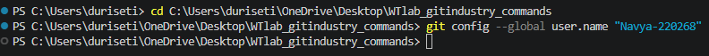

### git config --global user.email

**Syntax:**
git config --global user.email

**Purpose:**
Sets the global email address that will appear in your Git commits.

**Example:**
git config --global user.email "n220268@rguktn.ac.in"

**Output Screenshot:**
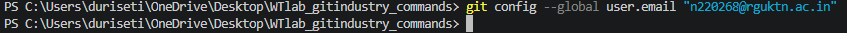

### git config --list

**Purpose:**
Displays all the Git configuration settings currently applied.

**Output Screenshot:**

## Repository set up commands

### git init

**Purpose:**
Creates a new Git repository in the current folder.

**Output Screenshot:**

### git clone

**Syntax:**
git clone "repo-link"

**Purpose:**
Copies an existing remote repository to your local system.

**Example:**
git clone https://github.com/navya-n220268/WTlab_gitindustry_commands.git

**Output Screenshot:**

### git clone --branch

**Syntax:**  
git clone --branch <branch_name> <repository_url>

**Purpose:**  
Clones a specific branch from a repository instead of the default branch.

**Example:**  
git clone --branch main https://github.com/navya-n220268/WTlab_gitindustry_commands.git

**Screenshot Proof:**  

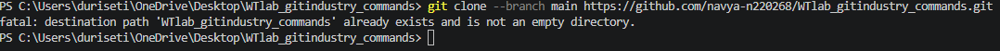

---

### git clone --depth

**Syntax:**  
git clone --depth <number> <repository_url>

**Purpose:**  
Creates a shallow clone with limited commit history to reduce download size.

**Example:**  
git clone --depth 1 https://github.com/navya-n220268/WTlab_gitindustry_commands.git

**Screenshot Proof:**  

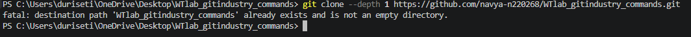

---

### git status

**Syntax:**  
git status

**Purpose:**  
Displays the current state of the working directory and staging area.
https
**Example:**  
git status

**Screenshot Proof:**  

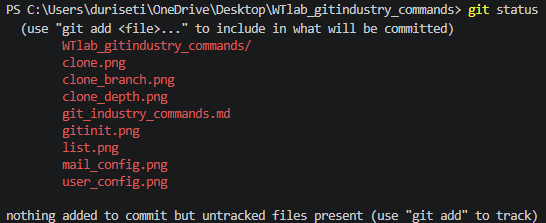

---

### git log

**Syntax:**  
git log

**Purpose:**  
Shows detailed commit history of the repository.

**Example:**  
git log

**Screenshot Proof:**  

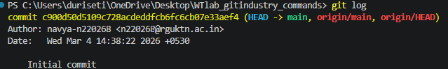

---

### git log --oneline

**Syntax:**  
git log --oneline

**Purpose:**  
Displays commit history in a compact one-line format.

**Example:**  
git log --oneline

**Screenshot Proof:**  

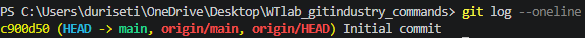

---

### git log --graph

**Syntax:**  
git log --graph

**Purpose:**  
Displays commits in a graphical tree structure.

**Example:**  
git log --graph

**Screenshot Proof:**  

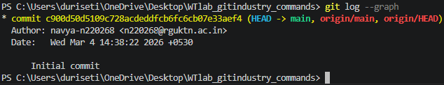

---

### git show

**Syntax:**  
git show <commit_id>

**Purpose:**  
Shows detailed information about a specific commit.

**Example:**  
git show HEAD

**Screenshot Proof:**  

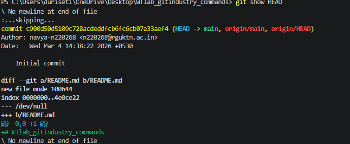

---

### git diff

**Syntax:**  
git diff

**Purpose:**  
Shows changes between working directory and staging area.

**Example:**  
git diff

**Screenshot Proof:**  

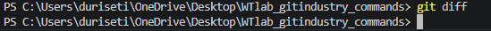

---

### git diff --staged

**Syntax:**  
git diff --staged

**Purpose:**  
Shows differences between staged changes and last commit.

**Example:**  
git diff --staged

**Screenshot Proof:**  

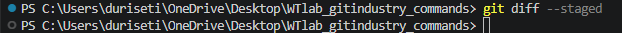

---

### git blame

**Syntax:**  
git blame <file_name>

**Purpose:**  
Displays who last modified each line of a file.

**Example:**  
git blame index.html

**Screenshot Proof:**  

---

### git reflog

**Syntax:**  
git reflog

**Purpose:**  
Shows history of all HEAD movements and commits.

**Example:**  
git reflog

**Screenshot Proof:**  

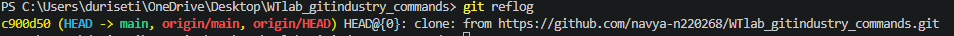

---

### git shortlog

**Syntax:**  
git shortlog

**Purpose:**  
Summarizes commit history grouped by author.

**Example:**  
git shortlog

**Screenshot Proof:**  

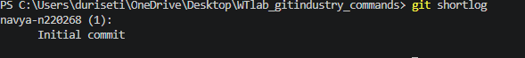

### git add

**Syntax:**  
git add <file_name>

**Purpose:**  
Adds a specific file to the staging area.

**Example:**  
git add git_industry_commands.md

**Screenshot Proof:**  

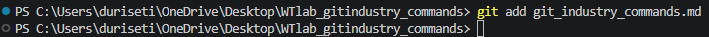

---

### git add .

**Syntax:**  
git add .

**Purpose:**  
Adds all files in the current directory to the staging area.

**Example:**  
git add .

**Screenshot Proof:**  

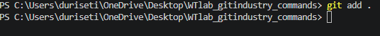

---

### git add -p

**Syntax:**  
git add -p

**Purpose:**  
Allows adding changes interactively in parts (hunks).

**Example:**  
git add -p

**Screenshot Proof:**  

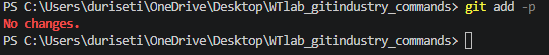

---

### git restore

**Syntax:**  
git restore <file_name>

**Purpose:**  
Restores a file to its last committed state.

**Example:**  
git restore git_industry_commands.md

**Screenshot Proof:**  

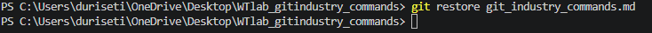

---

### git restore --staged

**Syntax:**  
git restore --staged <file_name>

**Purpose:**  
Removes a file from the staging area.

**Example:**  
git restore --staged git_industry_commands.md

**Screenshot Proof:**  

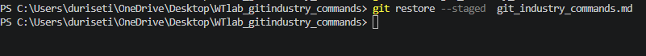

---

### git rm

**Syntax:**  
git rm <file_name>

**Purpose:**  
Removes a file from the repository and staging area.

**Example:**  
git rm file.txt

**Screenshot Proof:**  

---

### git mv

**Syntax:**  
git mv <old_name> <new_name>

**Purpose:**  
Renames or moves a file in the repository.

**Example:**  
git mv old.txt new.txt

**Screenshot Proof:**  

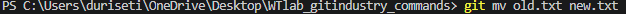

### git commit

**Syntax:**  
git commit

**Purpose:**  
Records changes from the staging area into the repository.

**Example:**  
git commit

**Screenshot Proof:**  

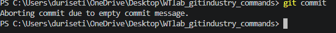

---

### git commit -m

**Syntax:**  
git commit -m "commit message"

**Purpose:**  
Commits changes with a descriptive message.

**Example:**  
git commit -m "Added new feature"

**Screenshot Proof:**  

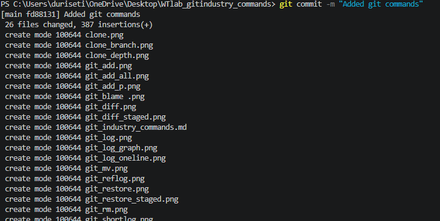

---

### git commit --amend

**Syntax:**  
git commit --amend

**Purpose:**  
Modifies the most recent commit (message or content).

**Example:**  
git commit --amend

**Screenshot Proof:**  

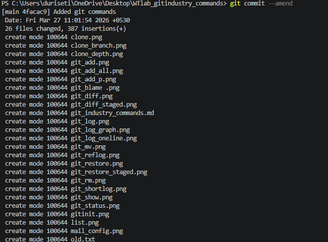

---

### git commit --no-edit

**Syntax:**  
git commit --amend --no-edit

**Purpose:**  
Amends the last commit without changing its commit message.

**Example:**  
git commit --amend --no-edit

**Screenshot Proof:**  

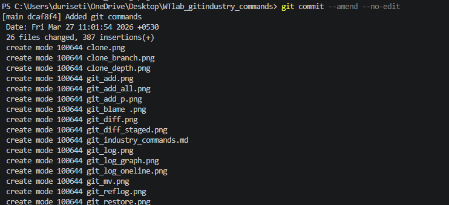

### git branch

**Syntax:**  
git branch

**Purpose:**  
Lists all local branches in the repository.

**Example:**  
git branch

**Screenshot Proof:**  

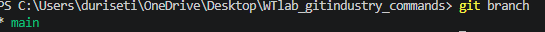

---

### git branch -a

**Syntax:**  
git branch -a

**Purpose:**  
Lists all local and remote branches.

**Example:**  
git branch -a

**Screenshot Proof:**  

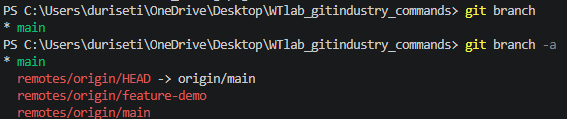

---

### git branch -d

**Syntax:**  
git branch -d <branch_name>

**Purpose:**  
Deletes a branch safely (only if merged).

**Example:**  
git branch -d feature

**Screenshot Proof:**  

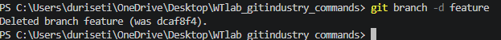

---

### git branch -D

**Syntax:**  
git branch -D <branch_name>

**Purpose:**  
Force deletes a branch even if not merged.

**Example:**  
git branch -D feature

**Screenshot Proof:**  

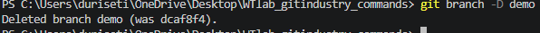

---

### git checkout

**Syntax:**  
git checkout <branch_name>

**Purpose:**  
Switches to an existing branch.

**Example:**  
git checkout main

**Screenshot Proof:**  

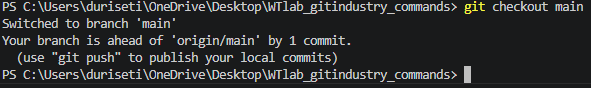

---

### git checkout -b

**Syntax:**  
git checkout -b <branch_name>

**Purpose:**  
Creates a new branch and switches to it.

**Example:**  
git checkout -b feature

**Screenshot Proof:**  

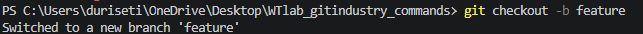

---

### git switch

**Syntax:**  
git switch <branch_name>

**Purpose:**  
Switches between branches (modern alternative to checkout).

**Example:**  
git switch main

**Screenshot Proof:**  

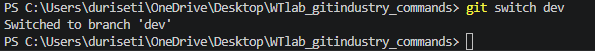

---

### git switch -c

**Syntax:**  
git switch -c <branch_name>

**Purpose:**  
Creates and switches to a new branch.

**Example:**  
git switch -c new-branch

**Screenshot Proof:**  

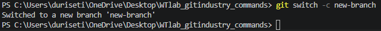

### git merge

**Syntax:**  
git merge <branch_name>

**Purpose:**  
Merges the specified branch into the current branch.

**Example:**  
git merge feature

**Screenshot Proof:**  

---

### git merge --no-ff

**Syntax:**  
git merge --no-ff <branch_name>

**Purpose:**  
Merges a branch while creating a merge commit, even if fast-forward is possible.

**Example:**  
git merge --no-ff feature

**Screenshot Proof:**  

### git remote

**Syntax:**  
git remote

**Purpose:**  
Displays the list of remote repositories.

**Example:**  
git remote

**Screenshot Proof:**  

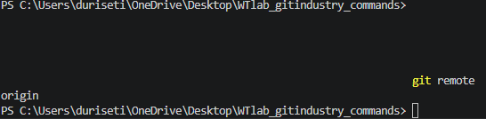

---

### git remote -v

**Syntax:**  
git remote -v

**Purpose:**  
Shows remote repositories with their URLs.

**Example:**  
git remote -v

**Screenshot Proof:**  

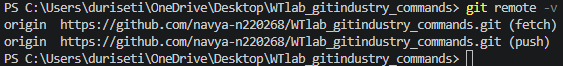

---

### git remote add

**Syntax:**  
git remote add <name> <repository_url>

**Purpose:**  
Adds a new remote repository.

**Example:**  
git remote add origin https://github.com/user/repo.git

**Screenshot Proof:**  

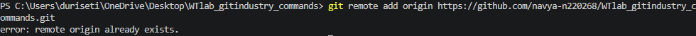

---

### git remote remove

**Syntax:**  
git remote remove <name>

**Purpose:**  
Removes a remote repository.

**Example:**  
git remote remove origin

**Screenshot Proof:**  

---

### git fetch

**Syntax:**  
git fetch

**Purpose:**  
Fetches updates from remote without merging.

**Example:**  
git fetch

**Screenshot Proof:**  

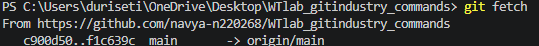

---

### git fetch --all

**Syntax:**  
git fetch --all

**Purpose:**  
Fetches updates from all remotes.

**Example:**  
git fetch --all

**Screenshot Proof:**  

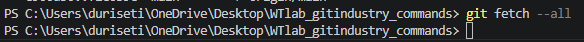

---

### git pull

**Syntax:**  
git pull

**Purpose:**  
Fetches and merges changes from remote.

**Example:**  
git pull

**Screenshot Proof:**  

---

### git pull --rebase

**Syntax:**  
git pull --rebase

**Purpose:**  
Fetches and rebases instead of merging.

**Example:**  
git pull --rebase

**Screenshot Proof:**  

---

### git push

**Syntax:**  
git push

**Purpose:**  
Pushes local commits to remote repository.

**Example:**  
git push

**Screenshot Proof:**  

---

### git push -u origin branch-name

**Syntax:**  
git push -u origin <branch_name>

**Purpose:**  
Pushes branch and sets upstream tracking.

**Example:**  
git push -u origin main

**Screenshot Proof:**  

---

### git push --force

**Syntax:**  
git push --force

**Purpose:**  
Force pushes changes (overwrites remote history).

**Example:**  
git push --force

**Screenshot Proof:**  

### git stash

**Syntax:**  
git stash

**Purpose:**  
Temporarily saves uncommitted changes and cleans the working directory.

**Example:**  
 git stash

**Screenshot Proof:**  

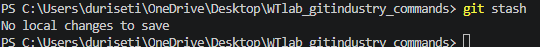

---

### git stash list

**Syntax:**  
git stash list

**Purpose:**  
Displays all saved stashes.

**Example:**  
 git stash list

**Screenshot Proof:**  

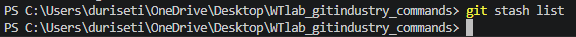

---

### git stash pop

**Syntax:**  
git stash pop

**Purpose:**  
Applies the latest stash and removes it from stash list.

**Example:**  
git stash pop

**Screenshot Proof:**  

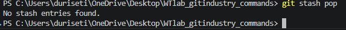

---

### git stash apply

**Syntax:**  
git stash apply

**Purpose:**  
Applies a stash without removing it from the stash list.

**Example:**  
git stash apply

**Screenshot Proof:**  

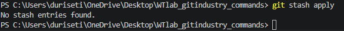

---

### git stash drop

**Syntax:**  
git stash drop <stash_id>

**Purpose:**  
Deletes a specific stash from the stash list.

**Example:**  
git stash drop stash@{0}

**Screenshot Proof:**  

---

### git stash clear

**Syntax:**  
git stash clear

**Purpose:**  
Deletes all stashes permanently.

**Example:**  
PS C:\Users\duriseti\OneDrive\Desktop\WTlab_gitindustry_commands> git stash clear

**Output:**  
(no output, all stashes cleared)

**Screenshot Proof:**  

### git reset

**Syntax:**  
git reset <commit_id>

**Purpose:**  
Resets the current HEAD to a specified commit.

**Example:**  
git reset HEAD~1

**Screenshot Proof:**  

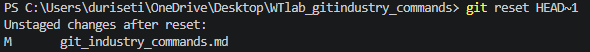

---

### git reset --soft

**Syntax:**  
git reset --soft <commit_id>

**Purpose:**  
Moves HEAD to a previous commit but keeps changes staged.

**Example:**  
git reset --soft HEAD~1

**Output:**  
(no visible output, changes remain staged)

**Screenshot Proof:**  

---

### git reset --mixed

**Syntax:**  
git reset --mixed <commit_id>

**Purpose:**  
Moves HEAD to a previous commit and unstages changes (default mode).

**Example:**  
 git reset --mixed HEAD~1

**Output:**  
Unstaged changes after reset

**Screenshot Proof:**  

---

### git reset --hard

**Syntax:**  
git reset --hard <commit_id>

**Purpose:**  
Moves HEAD to a previous commit and deletes all changes permanently.

**Example:**  
git reset --hard HEAD~1

**Output:**  
HEAD is now at abc123 Initial commit

**Screenshot Proof:**  

---

### git revert

**Syntax:**  
git revert <commit_id>

**Purpose:**  
Creates a new commit that undoes the changes of a previous commit.

**Example:**  
git revert HEAD

**Output:**  
[main abc123] Revert "Added feature"

**Screenshot Proof:**  

---

### git clean -f

**Syntax:**  
git clean -f

**Purpose:**  
Removes untracked files from the working directory.

**Example:**  
git clean -f

**Output:**  
Removing temp.txt

**Screenshot Proof:**  

---

### git clean -fd

**Syntax:**  
git clean -fd

**Purpose:**  
Removes untracked files and directories.

**Example:**  
git clean -fd

**Output:**  
Removing folder_name/

**Screenshot Proof:**  

### git rebase

**Syntax:**  
git rebase <branch_name>

**Purpose:**  
Reapplies commits on top of another base branch to maintain a linear history.

**Example:**  
 git rebase main

**Output:**  
Successfully rebased and updated current branch

**Screenshot Proof:**  

---

### git rebase -i

**Syntax:**  
git rebase -i <commit_id>

**Purpose:**  
Performs interactive rebase to edit, reorder, squash, or delete commits.

**Example:**  
git rebase -i HEAD~3

**Output:**  
(opens editor to modify commits)

**Screenshot Proof:**  

---

### git rebase --continue

**Syntax:**  
git rebase --continue

**Purpose:**  
Continues the rebase process after resolving conflicts.

**Example:**  
git rebase --continue

**Output:**  
Rebase continued successfully

**Screenshot Proof:**  

---

### git rebase --abort

**Syntax:**  
git rebase --abort

**Purpose:**  
Cancels the rebase process and returns to the previous state.

**Example:**  
git rebase --abort

**Output:**  
Rebase aborted

**Screenshot Proof:**  

### git cherry-pick

**Syntax:**  
git cherry-pick <commit_id>

**Purpose:**  
Applies a specific commit from another branch to the current branch.

**Example:**  
 git cherry-pick abc123

**Output:**  
[main abc123] Applied commit from another branch

**Screenshot Proof:**  

---

### git cherry-pick --continue

**Syntax:**  
git cherry-pick --continue

**Purpose:**  
Continues cherry-pick after resolving conflicts.

**Example:**  
 git cherry-pick --continue

**Output:**  
Cherry-pick completed

**Screenshot Proof:**  

---

### git cherry-pick --abort

**Syntax:**  
git cherry-pick --abort

**Purpose:**  
Cancels the cherry-pick process.

**Example:**  
 git cherry-pick --abort

**Output:**  
Cherry-pick aborted

**Screenshot Proof:**  

---

### git format-patch

**Syntax:**  
git format-patch <commit_id>

**Purpose:**  
Creates patch files from commits.

**Example:**  
 git format-patch HEAD~1

**Output:**  
0001-commit-message.patch

**Screenshot Proof:**  

---

### git apply

**Syntax:**  
git apply <patch_file>

**Purpose:**  
Applies a patch file to the working directory.

**Example:**  
git apply 0001-commit-message.patch

**Output:**  
Patch applied successfully

**Screenshot Proof:**  

### git tag

**Syntax:**  
git tag

**Purpose:**  
Lists all tags in the repository.

**Example:**  
git tag

**Output:**  
v1.0  
v2.0

**Screenshot Proof:**  

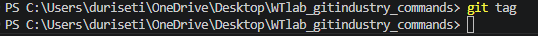

---

### git tag -a

**Syntax:**  
git tag -a <tag_name> -m "message"

**Purpose:**  
Creates an annotated tag with a message.

**Example:**  
 git tag -a v1.0 -m "First version"

**Output:**  
(no output, tag created)

**Screenshot Proof:**  

---

### git tag -d

**Syntax:**  
git tag -d <tag_name>

**Purpose:**  
Deletes a tag from the local repository.

**Example:**  
 git tag -d v1.0

**Output:**  
Deleted tag 'v1.0'

**Screenshot Proof:**  

---

### git push origin --tags

**Syntax:**  
git push origin --tags

**Purpose:**  
Pushes all tags to the remote repository.

**Example:**  
 git push origin --tags

**Output:**  
Tags pushed to remote

**Screenshot Proof:**  

---

### git submodule add

**Syntax:**  
git submodule add <repository_url>

**Purpose:**  
Adds another Git repository as a submodule.

**Example:**  
 git submodule add https://github.com/navya-n220268/WTlab_gitindustry_commands.git

**Output:**  
Submodule added

**Screenshot Proof:**  

---

### git submodule init

**Syntax:**  
git submodule init

**Purpose:**  
Initializes submodules in the repository.

**Example:**  
 git submodule init

**Output:**  
Submodule initialized

**Screenshot Proof:**  

---

### git submodule update

**Syntax:**  
git submodule update

**Purpose:**  
Updates submodules to match the committed version.

**Example:**  
 git submodule update

**Output:**  
Submodule updated

**Screenshot Proof:**  

---

### git bisect

**Syntax:**  
git bisect

**Purpose:**  
Starts the binary search process to find a bug-causing commit.

**Example:**  
 git bisect

**Output:**  
Bisecting started

**Screenshot Proof:**  

---

### git bisect start

**Syntax:**  
git bisect start

**Purpose:**  
Begins the bisect process.

**Example:**  
git bisect start

**Output:**  
Bisecting: start

**Screenshot Proof:**  

---

### git bisect good

**Syntax:**  
git bisect good <commit_id>

**Purpose:**  
Marks a commit as good (no bug).

**Example:**  
> git bisect good abc123

**Output:**  
Marked as good

**Screenshot Proof:**  

---

### git bisect bad

**Syntax:**  
git bisect bad <commit_id>

**Purpose:**  
Marks a commit as bad (contains bug).

**Example:**  
 git bisect bad def456

**Output:**  
Marked as bad

**Screenshot Proof:**  

